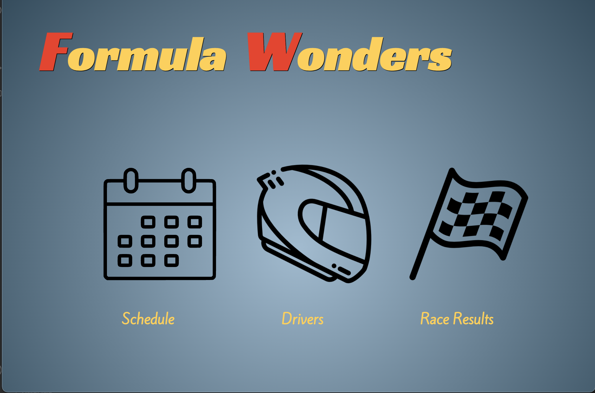
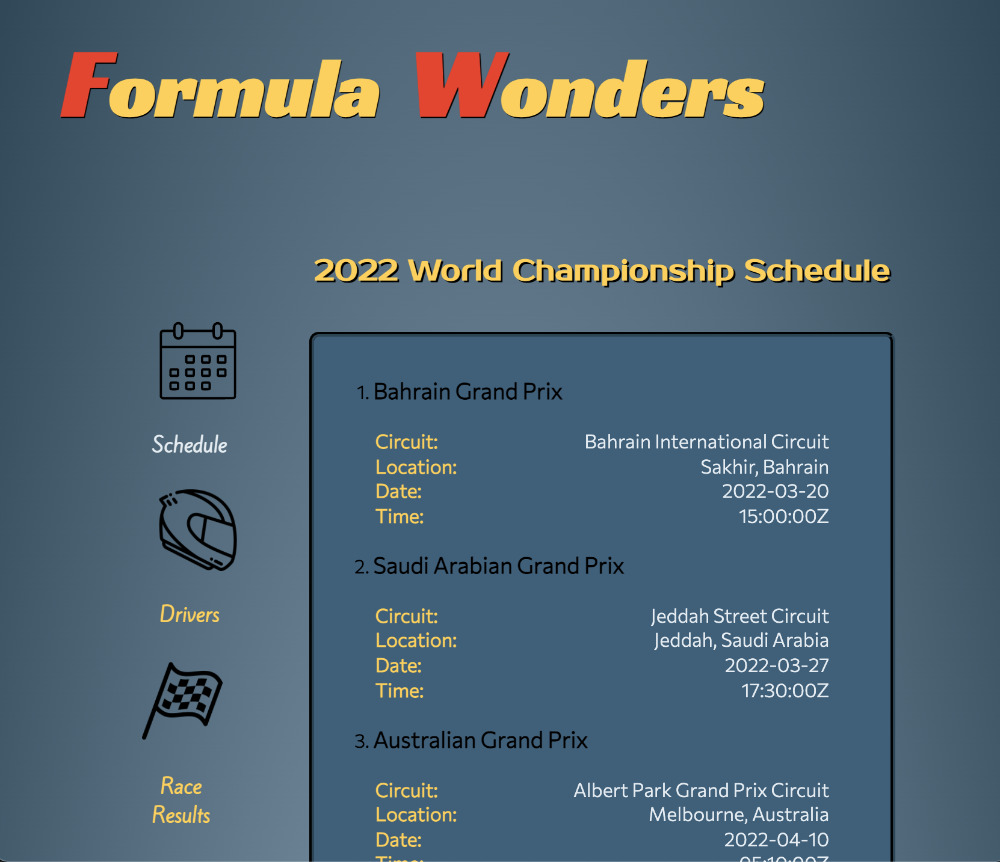
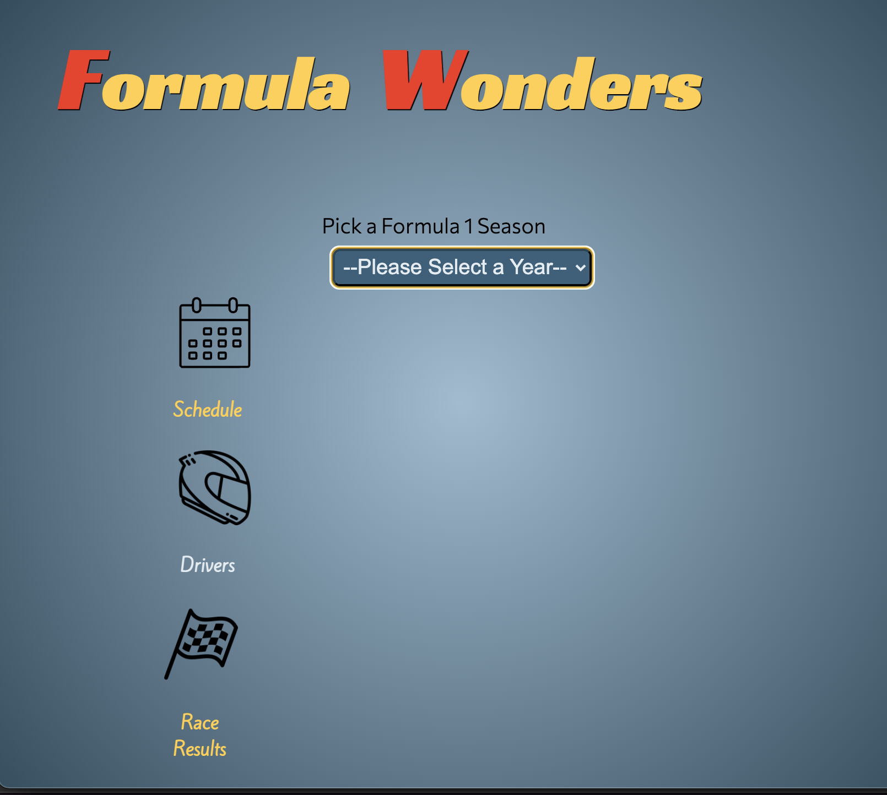
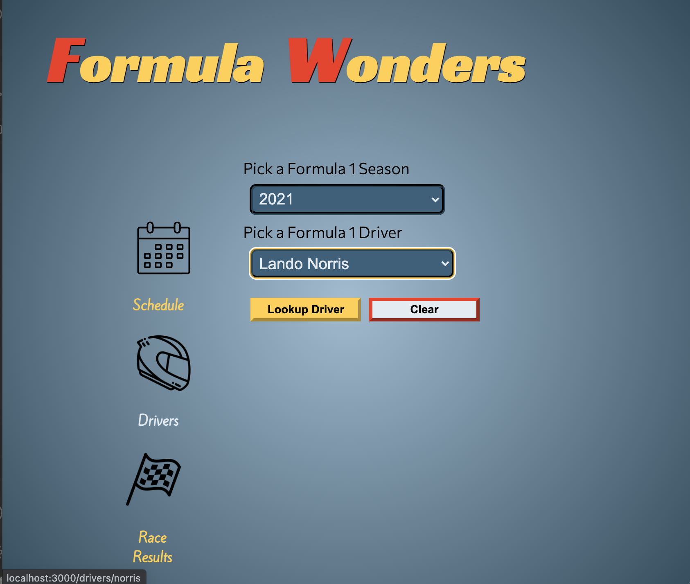
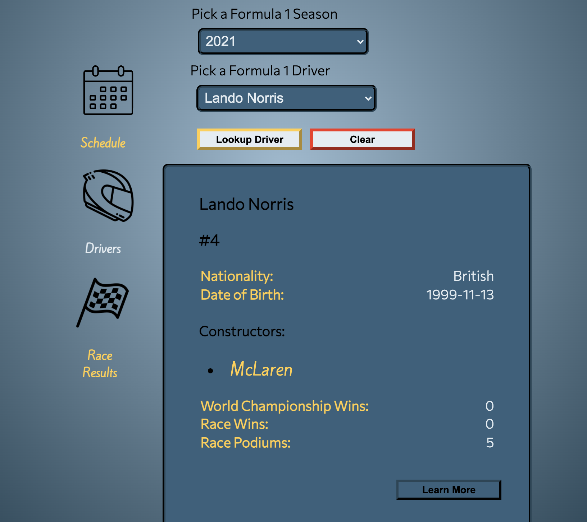

# Formula Wonders

### Mod3 Showcase

## Table of Contents
- [Abstract](#Abstract)
- [Technologies](#Technologies)
- [Illustrations](#Illustrations)
- [Install](#Install)
- [Wins](#Wins)
- [Challenges](#Challenges)
- [Additions](#Additions)
- [Contributors](#Contributors)

## Abstract
Formula Wonders is an app intended to provide just the most essential information for the casual Formula One fan who is too busy to keep fully up to date or know who won the championship in 1974. 
The home page provides just three options: Schedule, Race Results, and Drivers. 
- Clicking the `Schedule` icon will take you to a page that displays the race schedule for the current F1 season. 
- Clicking the `Results` icon, from Home or from any other page, will display the results from the most recently completed race. 
- Clicking the `Drivers` icon will take you to a page where you can lookup basic stats for every driver in the history of the sport. 
    - First select a year from the dropdown.
    - You will then be prompted to choose a driver from the second dropdown
    - You can then click the `Lookup Driver` button, and the app will display ino for the selected driver. 
    - The constructors(teams) that a driver has competed for, are links to the that team's wikipedia page. 
    - Similarly, the `Learn More` button at the bottom of the driver stats will link you to the driver's wikipedia page. 
    - At any point, you can click the `Formula Wonders` header to return to the home page.

## Technologies
-  HTML
-  CSS
-  SASS
-  JavaScript
-  React
-  React-Router
-  Hooks
-  Cypress 

## Illustrations

## Install

-  Clone this [repo](https://github.com/elisebeall/dnd-spells) to your machine
-  cd into the directory `formula-wonders`
-  Run `npm install`
-  Run `npm start`

## Wins
- Successfully working with a complex API that offered a massive number of possible endpoints
- Using Hooks to help manage state
- Creating the illusion of a multi-page app using Router, including the use of a nested route.

## Challenges
- Working with asynchronous JS and multiple levels of conditional rendering
- Extracting the necessary data from API endpoints that were many object levels deep
- Error handling

## Additions
### Future Iterations
- Turn driver names in the race results into links to their driver info page
- Add additional filtering options for drivers, and a search function.
- Add photos for drivers.
- Countdown calendar for the next race.
- Better format for dates and times, including localized timezones. 

## Creator
- [August Reid](https://github.com/augustreid)